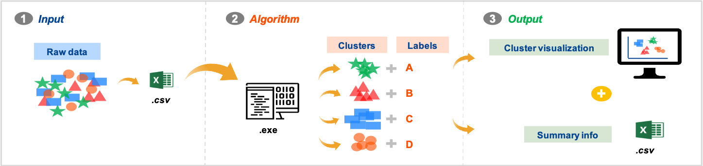
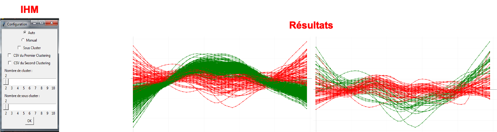

# SAFRAN_Pattern_Recognition
Project about an IHM (Tkinter) for clustering about specific data and try to identufy some patterns

 

## Project
The purpose of this project is to realize an IHM to set up the clustering desired (number of pattern or optimized number of pattern).
This application is going to be used by expert analyzer from airplane engine to identify some insights or problems in production.

This is an example of IHM and pattern result :

 
